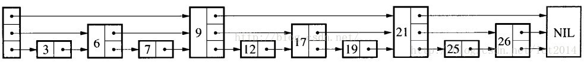
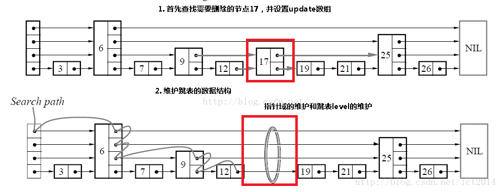

## 简介

SkipList(跳表)这种数据结构是由William Pugh于1990年在在 Communications of the ACM June 1990, 33(6) 668-676 发表了Skip lists: a probabilistic alternative to balanced trees，在其中详细描述了他的工作。由论文标题可知，SkipList的设计初衷是作为替换平衡树的一种选择。

我们都知道，AVL树有着严格的O(logN)的查询效率，但是由于插入过程中可能需要多次旋转，导致插入效率较低，因而才有了在工程界更加实用的红黑树。

但是红黑树有一个问题就是在并发环境下使用不方便，比如需要更新数据时，Skip需要更新的部分比较少，锁的东西也更少，而红黑树有个平衡的过程，在这个过程中会涉及到较多的节点，需要锁住更多的节点，从而降低了并发性能。

SkipList还有一个优势就是实现简单，SkipList的实现只花了2个小时，而红黑树，我可能得2天。

时隔将近三十多年，SkipList这种数据结构仍在许多途径有用武之地，比如Redis, 还有Google的著名项目Bigtable.

## 原理及实现

其实跳表就是在普通单向链表的基础上增加了一些索引，而且这些索引是分层的，从而可以快速地查的到数据。如下是一个典型的跳表:



### 查找

查找示意图如下:


比如我们要查找key为19的结点，那么我们不需要逐个遍历，而是按照如下步骤:

- 从header出发，从高到低的level进行查找，先索引到9这个结点，发现9 < 19,继续查找(然后在level==2这层)，查找到21这个节点，由于21 > 19, 所以结点不往前走，而是level由2降低到1
- 然后索引到17这个节点，由于17 < 19, 所以继续往后，索引到21这个结点，发现21>19, 所以level由1降低到0
- 在结点17上，level==0索引到19,查找完毕。
- 如果在level==0这层没有查找到，那么说明不存在key为19的节点，查找失败


既然算法都有了，实现也不在话下，如下是C++实现:
```cpp
    template<typename K, typename V>
    Node<K, V> *SkipList<K, V>::search(const K key) const {
        Node<K, V> *node = header;
        for (int i = level; i >= 0; --i) {
            while ((node->forward[i])->key < key) {
                node = *(node->forward + i);
            }
        }
        node = node->forward[0];
        if (node->key == key) {
            return node;
        } else {
            return nullptr;
        }
    };
```
### 插入

如下是插入结点示意图:


其实插入节点的关键就是找到合适的插入位置，即从所有小于待插入节点key值的节点中，找出最大的那个，所以插入节点的过程如下:

- 查找合适的插入位置，比如上图中要插入key为17的结点，就需要一路查找到12,由于12 < 17,而12的下一个结点19 > 17,因而满足条件
- 创建新结点，并且产生一个在1~MAX_LEVEL之间的随机level值作为该结点的level
- 调整指针指向

插入的代码如下:
```cpp
    template<typename K, typename V>
    bool SkipList<K, V>::insert(K key, V value) {
        Node<K, V> *update[MAX_LEVEL];

        Node<K, V> *node = header;

        for (int i = level; i >= 0; --i) {
            while ((node->forward[i])->key < key) {
                node = node->forward[i];
            }
            update[i] = node;
        }
        //首个结点插入时，node->forward[0]其实就是footer
        node = node->forward[0];

        //如果key已存在，则直接返回false
        if (node->key == key) {
            return false;
        }

        int nodeLevel = getRandomLevel();

        if (nodeLevel > level) {
            nodeLevel = ++level;
            update[nodeLevel] = header;
        }

        //创建新结点
        Node<K, V> *newNode;
        createNode(nodeLevel, newNode, key, value);

        //调整forward指针
        for (int i = nodeLevel; i >= 0; --i) {
            node = update[i];
            newNode->forward[i] = node->forward[i];
            node->forward[i] = newNode;
        }
        ++nodeCount;

    #ifdef DEBUG
        dumpAllNodes();
    #endif

        return true;
    };
```


### 移除

移除结点的示意图如下:



移除结点其实很简单,就分以下3步:

- 查找到指定的结点，如果没找到则返回
- 调整指针指向
- 释放结点空间

代码如下:
``` cpp
    template<typename K, typename V>
    bool SkipList<K, V>::remove(K key, V &value) {
        Node<K, V> *update[MAX_LEVEL];
        Node<K, V> *node = header;
        for (int i = level; i >= 0; --i) {
            while ((node->forward[i])->key < key) {
                node = node->forward[i];
            }
            update[i] = node;
        }
        node = node->forward[0];
        //如果结点不存在就返回false
        if (node->key != key) {
            return false;
        }

        value = node->value;
        for (int i = 0; i <= level; ++i) {
            if (update[i]->forward[i] != node) {
                break;
            }
            update[i]->forward[i] = node->forward[i];
        }

        //释放结点
        delete node;

        //更新level的值，因为有可能在移除一个结点之后，level值会发生变化，及时移除可避免造成空间浪费
        while (level > 0 && header->forward[level] == footer) {
            --level;
        }

        --nodeCount;

    #ifdef DEBUG
        dumpAllNodes();
    #endif

        return true;
    };

```


